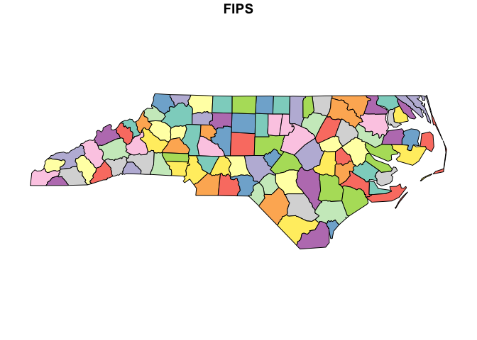
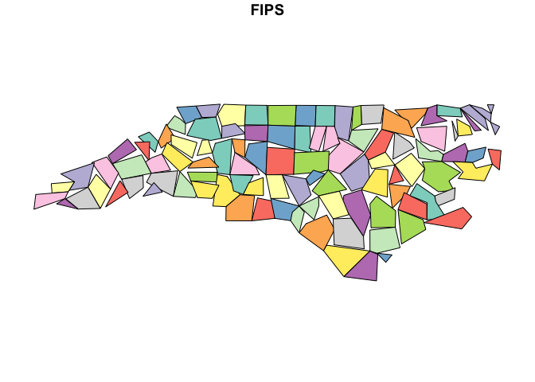

<!-- README.md is generated from README.Rmd. Please edit that file -->
<!-- badges: start -->

[](https://app.codecov.io/gh/ateucher/rmapshaper?branch=master)
[](https://cran.r-project.org/package=rmapshaper)
[](https://cran.r-project.org/package=rmapshaper)
[](https://cran.r-project.org/package=rmapshaper)
[](https://github.com/ateucher/rmapshaper/actions/workflows/R-CMD-check.yaml)
<!-- badges: end -->

# rmapshaper

An R package providing access to the awesome
[mapshaper](https://github.com/mbloch/mapshaper/) tool by Matthew Bloch,
which has both a [Node.js command-line
tool](https://github.com/mbloch/mapshaper/wiki/Introduction-to-the-Command-Line-Tool)
as well as an [interactive web tool](https://mapshaper.org/).

I started this package so that I could use mapshaper’s
[Visvalingam](https://bost.ocks.org/mike/simplify/) simplification
method in R. There is, as far as I know, no other R package that
performs topologically-aware multi-polygon simplification. (This means
that shared boundaries between adjacent polygons are always kept intact,
with no gaps or overlaps, even at high levels of simplification).

But mapshaper does much more than simplification, so I am working on
wrapping most of the core functionality of mapshaper into R functions.

So far, `rmapshaper` provides the following functions:

- `ms_simplify` - simplify polygons or lines
- `ms_clip` - clip an area out of a layer using a polygon layer or a
  bounding box. Works on polygons, lines, and points
- `ms_erase` - erase an area from a layer using a polygon layer or a
  bounding box. Works on polygons, lines, and points
- `ms_dissolve` - aggregate polygon features, optionally specifying a
  field to aggregate on. If no field is specified, will merge all
  polygons into one.
- `ms_explode` - convert multipart shapes to single part. Works with
  polygons, lines, and points in geojson format, but currently only with
  polygons and lines in the `Spatial` classes (not `SpatialMultiPoints`
  and `SpatialMultiPointsDataFrame`).
- `ms_lines` - convert polygons to topological boundaries (lines)
- `ms_innerlines` - convert polygons to shared inner boundaries (lines)
- `ms_points` - create points from a polygon layer
- `ms_filter_fields` - Remove fields from the attributes
- `ms_filter_islands` - Remove small detached polygons

If you run into any bugs or have any feature requests, please file an
[issue](https://github.com/ateucher/rmapshaper/issues/)

### Installation

`rmapshaper` is on CRAN. Install the current version with:

``` r
install.packages("rmapshaper")
```

You can install the development version from github with `remotes`:

``` r
## install.packages("remotes")
library(remotes)
install_github("ateucher/rmapshaper")
```

### Usage

rmapshaper works with `sf` objects as well as geojson strings (character
objects of class `geo_json`). It also works with `Spatial` classes from
the `sp` package, though this will likely be retired in the future;
users are encouraged to use the more modern `sf` package.

We will use the `nc.gpkg` file (North Carolina county boundaries) from
the `sf` package and read it in as an `sf` object:

``` r
library(rmapshaper)
library(sf)
#> Linking to GEOS 3.11.0, GDAL 3.5.3, PROJ 9.1.0; sf_use_s2() is TRUE

file <- system.file("gpkg/nc.gpkg", package = "sf")
nc_sf <- read_sf(file)
```

Plot the original:

``` r
plot(nc_sf["FIPS"])
```

<!-- -->

Now simplify using default parameters, then plot the simplified North
Carolina counties:

``` r
nc_simp <- ms_simplify(nc_sf)
plot(nc_simp["FIPS"])
```

<!-- -->

You can see that even at very high levels of simplification, the
mapshaper simplification algorithm preserves the topology, including
shared boundaries. The `keep` parameter specifies what proportion of
vertices to keep:

``` r
nc_very_simp <- ms_simplify(nc_sf, keep = 0.001)
plot(nc_very_simp["FIPS"])
```

<!-- -->

Compare this to the output using `sf::st_simplify`, where overlaps and
gaps are evident:

``` r

nc_stsimp <- st_simplify(nc_sf, preserveTopology = TRUE, dTolerance = 10000) # dTolerance specified in meters
plot(nc_stsimp["FIPS"])
```

<!-- -->

This time we’ll demonstrate the `ms_innerlines` function:

``` r
nc_sf_innerlines <- ms_innerlines(nc_sf)
plot(nc_sf_innerlines)
```

<!-- -->

All of the functions are quite fast with `geojson` character objects.
They are slower with the `sf` and `Spatial` classes due to internal
conversion to/from json. If you are going to do multiple operations on
large `sf` objects, it’s recommended to first convert to json using
`geojsonsf::sf_geojson()`, or `geojsonio::geojson_json()`. All of the
functions have the input object as the first argument, and return the
same class of object as the input. As such, they can be chained
together. For a totally contrived example, using `nc_sf` as created
above:

``` r
library(geojsonsf)
library(rmapshaper)
library(sf)

## First convert 'states' dataframe from geojsonsf pkg to json

nc_sf %>% 
  sf_geojson() |> 
  ms_erase(bbox = c(-80, 35, -79, 35.5)) |>  # Cut a big hole in the middle
  ms_dissolve() |>  # Dissolve county borders
  ms_simplify(keep_shapes = TRUE, explode = TRUE) |> # Simplify polygon
  geojson_sf() |> # Convert to sf object
  plot(col = "blue") # plot
```

<!-- -->

### Using the system mapshaper

Sometimes if you are dealing with a very large spatial object in R,
`rmapshaper` functions will take a very long time or not work at all. As
of version `0.4.0`, you can make use of the system `mapshaper` library
if you have it installed. This will allow you to work with very large
spatial objects.

First make sure you have mapshaper installed:

``` r
check_sys_mapshaper()
#> mapshaper version 0.6.25 is installed and on your PATH
#>                     mapshaper-xl 
#> "/opt/homebrew/bin/mapshaper-xl"
```

If you get an error, you will need to install mapshaper. First install
node (<https://nodejs.org/en>) and then install mapshaper in a command
prompt with:

    $ npm install -g mapshaper

Then you can use the `sys` argument in any rmapshaper function:

``` r
nc_simp_internal <- ms_simplify(nc_sf)
nc_simp_sys <- ms_simplify(nc_sf, sys = TRUE, sys_mem=8) #sys_mem specifies the amount of memory to use in Gb.  It defaults to 8 if omitted. 

par(mfrow = c(1,2))
plot(st_geometry(nc_simp_internal), main = "internal")
plot(st_geometry(nc_simp_sys), main = "system")
```

<!-- -->

### Thanks

This package uses the [V8](https://cran.r-project.org/package=V8)
package to provide an environment in which to run mapshaper’s javascript
code in R. It relies heavily on all of the great spatial packages that
already exist (especially `sf`), and the `geojsonio` and the `geojsonsf`
packages for converting between `geojson`, `sf` and `Spatial` object.

Thanks to [timelyportfolio](https://github.com/timelyportfolio) for
helping me wrangle the javascript to the point where it works in V8. He
also wrote the [mapshaper
htmlwidget](https://github.com/timelyportfolio/mapshaper_htmlwidget),
which provides access to the mapshaper web interface, right in your R
session. We have plans to combine the two in the future.

### Code of Conduct

Please note that this project is released with a [Contributor Code of
Conduct](https://github.com/ateucher/rmapshaper/blob/master/CONDUCT.md).
By participating in this project you agree to abide by its terms.

### LICENSE

MIT
