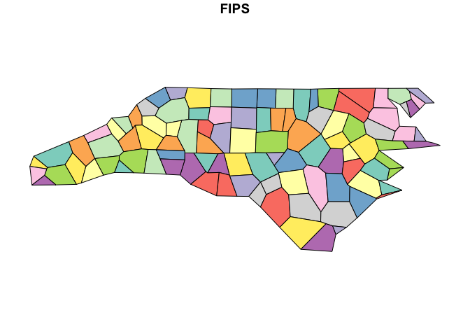

<!-- README.md is generated from README.Rmd. Please edit that file -->
<!-- badges: start -->

[](https://codecov.io/gh/ateucher/rmapshaper?branch=master)
[](https://github.com/ateucher/rmapshaper)
[](https://cran.r-project.org/package=rmapshaper)
[](https://cran.r-project.org/package=rmapshaper)
[](https://cran.r-project.org/package=rmapshaper)
<!-- badges: end -->

# rmapshaper

An R package providing access to the awesome
[mapshaper](https://github.com/mbloch/mapshaper/) tool by Matthew Bloch,
which has both a [Node.js command-line
tool](https://github.com/mbloch/mapshaper/wiki/Introduction-to-the-Command-Line-Tool)
as well as an [interactive web tool](https://mapshaper.org/).

I started this package so that I could use mapshaper’s
[Visvalingam](https://bost.ocks.org/mike/simplify/) simplification
method in R. There is, as far as I know, no other R package that
performs topologically-aware multi-polygon simplification. (This means
that shared boundaries between adjacent polygons are always kept intact,
with no gaps or overlaps, even at high levels of simplification).

But mapshaper does much more than simplification, so I am working on
wrapping most of the core functionality of mapshaper into R functions.

So far, `rmapshaper` provides the following functions:

-   `ms_simplify` - simplify polygons or lines
-   `ms_clip` - clip an area out of a layer using a polygon layer or a
    bounding box. Works on polygons, lines, and points
-   `ms_erase` - erase an area from a layer using a polygon layer or a
    bounding box. Works on polygons, lines, and points
-   `ms_dissolve` - aggregate polygon features, optionally specifying a
    field to aggregate on. If no field is specified, will merge all
    polygons into one.
-   `ms_explode` - convert multipart shapes to single part. Works with
    polygons, lines, and points in geojson format, but currently only
    with polygons and lines in the `Spatial` classes (not
    `SpatialMultiPoints` and `SpatialMultiPointsDataFrame`).
-   `ms_lines` - convert polygons to topological boundaries (lines)
-   `ms_innerlines` - convert polygons to shared inner boundaries
    (lines)
-   `ms_points` - create points from a polygon layer
-   `ms_filter_fields` - Remove fields from the attributes
-   `ms_filter_islands` - Remove small detached polygons

If you run into any bugs or have any feature requests, please file an
[issue](https://github.com/ateucher/rmapshaper/issues/)

### Installation

`rmapshaper` is on CRAN. Install the current version with:

``` r
install.packages("rmapshaper")
```

You can install the development version from github with `remotes`:

``` r
## install.packages("remotes")
library(remotes)
install_github("ateucher/rmapshaper")
```

### Usage

rmapshaper works with geojson strings (character objects of class
`geo_json`) and `list` geojson objects of class `geo_list`. These
classes are defined in the `geojsonio` package. It also works with
`Spatial` classes from the `sp` package, and with `sf` and `scf` objects
from the `sf` package.

We will use the `states` dataset from the `geojsonio` package and first
turn it into a `geo_json` object:

``` r
library(geojsonio)
#> Registered S3 method overwritten by 'geojsonsf':
#>   method        from   
#>   print.geojson geojson
#> 
#> Attaching package: 'geojsonio'
#> The following object is masked from 'package:base':
#> 
#>     pretty
library(rmapshaper)
#> Registered S3 method overwritten by 'geojsonlint':
#>   method         from 
#>   print.location dplyr
library(sp)
library(sf)
#> Linking to GEOS 3.8.1, GDAL 3.2.1, PROJ 7.2.1

## First convert to json
states_json <- geojson_json(states, geometry = "polygon", group = "group")
#> Assuming 'long' and 'lat' are longitude and latitude, respectively

## For ease of illustration via plotting, we will convert to a `SpatialPolygonsDataFrame`:
states_sp <- geojson_sp(states_json)

## Plot the original
plot(states_sp)
```


``` r
## Now simplify using default parameters, then plot the simplified states
states_simp <- ms_simplify(states_sp)
#> Warning in sp::proj4string(sp): CRS object has comment, which is lost in output
plot(states_simp)
```


You can see that even at very high levels of simplification, the
mapshaper simplification algorithm preserves the topology, including
shared boundaries:

``` r
states_very_simp <- ms_simplify(states_sp, keep = 0.001)
#> Warning in sp::proj4string(sp): CRS object has comment, which is lost in output
plot(states_very_simp)
```


Compare this to the output using `rgeos::gSimplify`, where overlaps and
gaps are evident:

``` r
library(rgeos)
#> rgeos version: 0.5-5, (SVN revision 640)
#>  GEOS runtime version: 3.8.1-CAPI-1.13.3 
#>  Linking to sp version: 1.4-5 
#>  Polygon checking: TRUE
states_gsimp <- gSimplify(states_sp, tol = 1, topologyPreserve = TRUE)
plot(states_gsimp)
```


The package also works with `sf` objects. This time we’ll demonstrate
the `ms_innerlines` function:

``` r
library(sf)

states_sf <- st_as_sf(states_sp)
states_sf_innerlines <- ms_innerlines(states_sf)
plot(states_sf_innerlines)
```



All of the functions are quite fast with `geo_json` character objects
and `geo_list` list objects. They are slower with the `Spatial` classes
due to internal conversion to/from json. Operating on `sf` objects is
faster than with `Spatial` objects, but not as fast as with the
`geo_json` or `geo_list`. If you are going to do multiple operations on
large `Spatial` objects, it’s recommended to first convert to json using
`geojson_list` or `geojson_json` from the `geojsonio` package. All of
the functions have the input object as the first argument, and return
the same class of object as the input. As such, they can be chained
together. For a contrived example, using `states_sp` as created above:

``` r
library(geojsonio)
library(rmapshaper)
library(sp)
library(magrittr)

## First convert 'states' dataframe from geojsonio pkg to json
states_json <- geojson_json(states, lat = "lat", lon = "long", group = "group", 
                            geometry = "polygon")

states_json %>% 
  ms_erase(bbox = c(-107, 36, -101, 42)) %>% # Cut a big hole in the middle
  ms_dissolve() %>% # Dissolve state borders
  ms_simplify(keep_shapes = TRUE, explode = TRUE) %>% # Simplify polygon
  geojson_sp() %>% # Convert to SpatialPolygonsDataFrame
  plot(col = "blue") # plot
```


### Using the system mapshaper

Sometimes if you are dealing with a very large spatial object in R,
`rmapshaper` functions will take a very long time or not work at all. As
of version `0.4.0`, you can make use of the system `mapshaper` library
if you have it installed. This will allow you to work with very large
spatial objects.

First make sure you have mapshaper installed:

``` r
check_sys_mapshaper()
#> mapshaper version 0.5.53 is installed and on your PATH
#>                  mapshaper-xl 
#> "/usr/local/bin/mapshaper-xl"
```

If you get an error, you will need to install mapshaper. First install
node (<https://nodejs.org/en/>) and then install mapshaper with:

    npm install -g mapshaper

Then you can use the `sys` argument in any rmapshaper function:

``` r
states_simp_internal <- ms_simplify(states_sf)
states_simp_sys <- ms_simplify(states_sf, sys = TRUE)

all.equal(states_simp_internal, states_simp_sys)
#>  [1] "Component \"geometry\": Component 1: Component 1: Mean relative difference: 0.03139317"  
#>  [2] "Component \"geometry\": Component 2: Component 1: Mean relative difference: 0.03351984"  
#>  [3] "Component \"geometry\": Component 3: Component 1: Mean relative difference: 0.02481586"  
#>  [4] "Component \"geometry\": Component 4: Component 1: Mean relative difference: 0.0625425"   
#>  [5] "Component \"geometry\": Component 5: Component 1: Mean relative difference: 0.03847964"  
#>  [6] "Component \"geometry\": Component 6: Component 1: Mean relative difference: 0.02028062"  
#>  [7] "Component \"geometry\": Component 7: Component 1: Mean relative difference: 0.01304473"  
#>  [8] "Component \"geometry\": Component 8: Component 1: Mean relative difference: 0.05068546"  
#>  [9] "Component \"geometry\": Component 9: Component 1: Mean relative difference: 0.03076616"  
#> [10] "Component \"geometry\": Component 10: Component 1: Mean relative difference: 0.03550646" 
#> [11] "Component \"geometry\": Component 11: Component 1: Mean relative difference: 0.02459161" 
#> [12] "Component \"geometry\": Component 12: Component 1: Mean relative difference: 0.02310049" 
#> [13] "Component \"geometry\": Component 13: Component 1: Mean relative difference: 0.04302159" 
#> [14] "Component \"geometry\": Component 14: Component 1: Mean relative difference: 0.04605118" 
#> [15] "Component \"geometry\": Component 15: Component 1: Mean relative difference: 0.02087527" 
#> [16] "Component \"geometry\": Component 16: Component 1: Mean relative difference: 0.02282804" 
#> [17] "Component \"geometry\": Component 17: Component 1: Mean relative difference: 0.02475744" 
#> [18] "Component \"geometry\": Component 18: Component 1: Mean relative difference: 0.01700793" 
#> [19] "Component \"geometry\": Component 19: Component 1: Mean relative difference: 0.01307087" 
#> [20] "Component \"geometry\": Component 20: Component 1: Mean relative difference: 0.01163646" 
#> [21] "Component \"geometry\": Component 21: Component 1: Mean relative difference: 0.02520351" 
#> [22] "Component \"geometry\": Component 22: Component 1: Mean relative difference: 0.03941653" 
#> [23] "Component \"geometry\": Component 23: Component 1: Mean relative difference: 0.02819596" 
#> [24] "Component \"geometry\": Component 24: Component 1: Mean relative difference: 0.02349732" 
#> [25] "Component \"geometry\": Component 25: Component 1: Mean relative difference: 0.04404438" 
#> [26] "Component \"geometry\": Component 26: Component 1: Mean relative difference: 0.02730449" 
#> [27] "Component \"geometry\": Component 27: Component 1: Mean relative difference: 0.04357254" 
#> [28] "Component \"geometry\": Component 28: Component 1: Mean relative difference: 0.0161367"  
#> [29] "Component \"geometry\": Component 29: Component 1: Mean relative difference: 0.01429417" 
#> [30] "Component \"geometry\": Component 30: Component 1: Mean relative difference: 0.03548754" 
#> [31] "Component \"geometry\": Component 31: Component 1: Mean relative difference: 0.03331207" 
#> [32] "Component \"geometry\": Component 32: Component 1: Mean relative difference: 0.003467503"
#> [33] "Component \"geometry\": Component 33: Component 1: Mean relative difference: 0.05236853" 
#> [34] "Component \"geometry\": Component 34: Component 1: Mean relative difference: 0.0337256"  
#> [35] "Component \"geometry\": Component 35: Component 1: Mean relative difference: 0.02353558" 
#> [36] "Component \"geometry\": Component 36: Component 1: Mean relative difference: 0.03420177" 
#> [37] "Component \"geometry\": Component 37: Component 1: Mean relative difference: 0.03062568" 
#> [38] "Component \"geometry\": Component 38: Component 1: Mean relative difference: 0.03140095" 
#> [39] "Component \"geometry\": Component 39: Component 1: Mean relative difference: 0.007568402"
#> [40] "Component \"geometry\": Component 40: Component 1: Mean relative difference: 0.02151849" 
#> [41] "Component \"geometry\": Component 41: Component 1: Mean relative difference: 0.02945216" 
#> [42] "Component \"geometry\": Component 42: Component 1: Mean relative difference: 0.01900139" 
#> [43] "Component \"geometry\": Component 43: Component 1: Mean relative difference: 0.06560268" 
#> [44] "Component \"geometry\": Component 44: Component 1: Mean relative difference: 0.03583831" 
#> [45] "Component \"geometry\": Component 45: Component 1: Mean relative difference: 0.01754127" 
#> [46] "Component \"geometry\": Component 46: Component 1: Mean relative difference: 0.03534092" 
#> [47] "Component \"geometry\": Component 47: Component 1: Mean relative difference: 0.02179796" 
#> [48] "Component \"geometry\": Component 48: Component 1: Mean relative difference: 0.02831459" 
#> [49] "Component \"geometry\": Component 49: Component 1: Mean relative difference: 0.02682678" 
#> [50] "Component \"geometry\": Component 50: Component 1: Mean relative difference: 0.04003401"
```

### Thanks

This package uses the [V8](https://cran.r-project.org/package=V8)
package to provide an environment in which to run mapshaper’s javascript
code in R. It relies heavily on all of the great spatial packages that
already exist (especially `sp` and `rgdal`), the `geojsonio` package for
converting between `geo_list`, `geo_json`, and `sf` and `Spatial`
objects, and the `jsonlite` package for converting between json strings
and R objects.

Thanks to [timelyportfolio](https://github.com/timelyportfolio) for
helping me wrangle the javascript to the point where it works in V8. He
also wrote the [mapshaper
htmlwidget](https://github.com/timelyportfolio/mapshaper_htmlwidget),
which provides access to the mapshaper web interface, right in your R
session. We have plans to combine the two in the future.

### Code of Conduct

Please note that this project is released with a [Contributor Code of
Conduct](https://github.com/ateucher/rmapshaper/blob/master/CONDUCT.md).
By participating in this project you agree to abide by its terms.

### LICENSE

MIT
